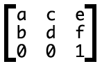

### 浏览器的主要组件

1. **用户界面** 除主窗口的 地址栏、书签、菜单等
2. **浏览器引擎** 用户界面和呈现引擎之前传递指令
3. **呈现引擎** 显示请求的内容。如请求HTML，将html、css等解析呈现。
4. **网络** 用于网站调用，如HTTP请求。
5. **用户界面后端**用于绘制基本的窗口小部件，如组合框，窗口。
6. **JAVASCRIPT解析器** 用于解析与执行javascript。
7. **数据存储** 也可叫持久层。如Cookie。Html5定义了“网络数据库”，轻便的浏览器内数据库。

参考**:** [**浏览器如何工作**](http://taligarsiel.com/Projects/howbrowserswork1.htm)

### 呈现引擎

#### _浏览器的主要组件_


默认情况下，呈现引擎可显示 HTML 和 XML 文档与图片。通过插件（或浏览器扩展程序），还可以显示其他类型的内容；例如，使用 PDF 查看器插件就能显示 PDF 文档。

Chrome 浏览器的每个标签页都分别对应一个呈现引擎实例。每个标签页都是一个独立的进程。

呈现引擎一开始会从网络层获取请求文档的内容。然后进行如下所示的基本流程：


▲_呈现引擎的主要流程_

1. 呈现（渲染）引擎将解析HTML文稿，将节点转换到一个叫“内容树”的DOM节点中。
2. 将HTML格式的样式信息，包括外部CSS，转换为另一个“渲染树”。渲染树包含视觉属性，如颜色，尺寸等。
3. 渲染树构建完成后，会经过一个“构建”过程，计算每个节点在屏幕的精确坐标。又叫layout和reflow过程。

web页面中元素的布局是相对的，因此一个元素的布局发生变化，会联动地引发其他元素的布局发生变化。比如，&lt;body&gt;元素的宽度的变化会影响其子元素的宽度，其子元素宽度的变化也会继续对其孙子元素产生影响。因此对于浏览器来说，布局过程是经常发生的。

* 绘制，本质上就是填充像素的过程。包括绘制文字、颜色、图像、边框和阴影等，也就是一个DOM元素所有的可视效果。一般来说，这个绘制过程是在多个层上完成的。。
* 渲染层合并。由上一步可知，对页面中DOM元素的绘制是在多个层上进行的。

在每个层上完成绘制过程之后，浏览器会将所有层按照合理的顺序合并成一个图层，然后显示在屏幕上。对于有位置重叠的元素的页面，这个过程尤其重要，因为一旦图层的合并顺序出错，将会导致元素显示异常。

**值得注意的是**，这个过程是逐步完成的，为了更好的用户体验，渲染引擎将会尽可能早的将内容呈现到屏幕上，并不会等到所有的html都解析完成之后再去构建和布局render树。它是解析完一部分内容就显示一部分内容，同时，可能还在通过网络下载其余内容。


▲_解析过程_


▲_Webkit主流程_


▲_Mozilla的Geoko 渲染引擎主流程_

从上图可以看出，尽管webkit和Gecko使用的术语稍有不同，他们的主要流程基本相同。Gecko称可见的格式化元素组成的树为frame树，每个元素都是一个frame，webkit则使用render树这个名词来命名由渲染对象组成的树。Webkit中元素的定位称为布局，而Gecko中称为回流。Webkit称利用dom节点及样式信息去构建render树的过程为attachment，Gecko在html和dom树之间附加了一层，这层称为内容接收器，相当制造dom元素的工厂

* Repaint——屏幕的一部分要重画，比如某个CSS的背景色变了。但是元素的几何尺寸没有变。

* Reflow/Layout——意味着元件的几何尺寸变了，我们需要重新验证并计算Render Tree。是Render Tree的一部分或全部发生了变化。这就是Reflow，或是Layout。（HTML使用的是flow based layout，也就是流式布局，所以，如果某元件的几何尺寸发生了变化，需要重新布局，也就叫reflow）reflow 会从&lt;html&gt;这个root frame开始递归往下，依次计算所有的结点几何尺寸和位置，在reflow过程中，可能会增加一些frame，比如一个文本字符串必需被包装起来。

**reflow有如下的几个原因：**

Initial。网页初始化的时候。

Incremental。一些Javascript在操作DOM Tree时。

Resize。其些元件的尺寸变了。

StyleChange。如果CSS的属性发生变化了。

Dirty。几个Incremental的reflow发生在同一个frame的子树上

#### WebKit的解析器

* #### **DOM**

输出的树，也就是解析树，是由DOM元素及属性节点组成的。DOM是文档对象模型的缩写，它是html文档的对象表示，作为html元素的外部接口供js等调用。

树的根是“document”对象。

DOM和标签基本是一一对应的关系，例如，如下的标签：

```
<html>
<body>

    <p>

      Hello DOM

    </p>

    <div></div>

</body>
```

将会被转换为下面的DOM树：


_示例标签对应的DOM树_

* #### **CSS**

每个CSS文件解析成StyleSheet对象，每个对象都包含CSS规则。该CSS规则对象包含选择器和声明对象，以及对应的CSS语法的其他对象。


▲_CSS解析_

#### 性能分析 {#-1}

了解下css的匹配规则

```
<!-- css -->
<style>
    .con .example p span { display: block; }
</style>
<!— html -->
<div class="con">
    <div class="example">
        <p>
            <span>文字</span>
        </p>
    </div>
</div>
```

我们对con类下example类中的p标签里的span 进行定义，那么css如何匹配这个规则呢？

> **css的匹配原理不是从左到右的，而是从右到左的**，也就是说我们的这行代码里面，先查找到页面里面所有的span元素形成一个集合，再在所有的span元素往上查找，看看有多span的父元素是p元素或者父元素的父元素是p元素或者......慢慢寻找，把父元素不是p元素的删去，再往上查找看集合里的有p元素又多少它的父元素有没有带example类。。。

**那为什么从右向左的规则要比从左向右的高效？**

如图：


假如 DOM 的结构如上图，匹配规则是 .mod-nav h3 span。若从左向右的匹配，过程是：从 .mod-nav 开始，遍历子节点 header 和子节点 div，然后各自向子节点遍历。在右侧 div 的分支中，最后遍历到叶子节点 a ，发现不符合规则，需要回溯到 ul 节点，再遍历下一个 li-a，假如有 1000 个 li，则这 1000 次的遍历与回溯会损失很多性能。再看看从右至左的匹配：先找到所有的最右节点 span，对于每一个 span，向上寻找节点 h3，由 h3再向上寻找 class=mod-nav 的节点，最后找到根元素 html 则结束这个分支的遍历。很明显，两种匹配规则的性能差别很大。之所以会差别很大，是因为从右向左的匹配在第一步就筛选掉了大量的不符合条件的最右节点（叶子节点）；而从左向右的匹配规则的性能都浪费在了失败的查找上面。当然这是比较明显情况，如果在叶子上存在多个不符合条件的 span，从右向左的规则也会走一些弯路（这时就需要优化 CSS 选择器了）。但平均来说它还是更高效，因为大多时候，一个 DOM 树中，符合匹配条件的节点（如 .mod-nav h3 span）远少于不符合条件的节点。

* **如何从CSS编写优化加载性能 （引：**[**如何优化CSS**](http://www.cnblogs.com/xiaoloulan/p/5801663.html)**）**

1，减少css嵌套，最好不要套三层以上，一般情况下块级元素加上类，里面的内联元素不用加，css写的时候块级class套内联tag，这样不仅可以减少css文件大小，还能减少性能浪费。

2，不要在ID选择器前面进行嵌套，ID本来就是唯一的而且人家权值那么大，前方嵌套完全是浪费性能。

3，建立公共样式类，把长段相同样式提取出来作为公共类使用，比如我们常用的清除浮动，单行超出显示省略号等等等，当然如果你使用sass，继承会让你更加方便。

4，缩写css，其中包括缩写margin，padding，颜色值等等，要是有两个或者两个以上的margin-_\*\*_，写成margin: _ _ _ _有助于文件大小。

5，减少通配符\*或者类似\[hidden="true"\]这类选择器的使用，挨个查找所有...稍影响性能。

6，有些人喜欢在类名前面加上标签名：p.ty\_p 来进行更加精确的定位，但是这样往往效率更差，类名应该在全局范围除非公用是唯一的，所以这种做法是应该便面的。

7，巧妙运用css的继承机制，在css中很多属性是可以继承的比如颜色字体等等，父节点定义了，子节点就无需定义。

8，拆分出公共css文件，对于比较大的项目我们可以将大部分页面的公共结构的样式提取出来放到单独css文件里，这样一次下载后就放到缓存里，当然这种做法会增加请求，具体做法应以实际情况而定。

9，少用css表达式，要记住的是无论我们怎么炫酷，到了最后都是静态的，所以表达式只是让你的代码显得更加炫酷，但是他对性能的浪费可能是超乎你的想象的，因为它并不只是计算一次，一些小的事件可能都会增加它为了有效准确而进行计算求值的次数。

10，少用css reset，可能你会觉得重置样式是规范，但是其实其中有很多的操作是不必要不友好的，有需求有兴趣的朋友可以选择normolize.css。

Reset通过为几乎所有的元素施加默认样式，强行使得元素有相同的视觉效果。相比之下，Normalize.css保持了许多默认的浏览器样式。这就意味着你不用再为所有公共的排版元素重新设置样式。当一个元素在不同的浏览器中有不同的默认值时，Normalize.css会力求让这些样式保持一致并尽可能与现代标准相符合。

11，cssSprite，合成所有icon图片，用宽高加上bacgroud-position的背景图方式显现出我们要的icon图，这是一种十分实用的技巧，极大减少了http请求。

#### CSS动画性能

**首先，导致元素大小变化的动画会触发页面layout、paint、composited。**

为了得到更流畅的CSS动画效果，你需要尽量做到如下条件：

1. 动画中尽量少使用能触发layout和paint的CSS属性，使用更低耗的transform、opacity等属性
2. 尽量减少或者固定层的数量，不要在动画过程中创建层
3. 尽量减少层的更新（paint）次数

CSS变化对浏览器重绘的影响参考ccstrggers：[https://csstriggers.com](https://csstriggers.com)


**使用transform/opacity**

从性能方面考虑，最理想的渲染流水线是没有布局和绘制环节的，只需要做渲染层的合并即可

为了实现上述效果，你需要对元素谨慎使用会被修改的样式属性，只能使用那些仅触发渲染层合并的属性。目前，只有两个属性是满足这个条件的：**transform**和**opacity**：

应用了transform/opacity属性的元素必须_独占一个渲染层_。为了对这个元素创建一个自有的渲染层，你必须提升该元素。

.moving-element {  will-change: transform;}

或者，对于旧版本或不支持will-change属性的浏览器：

.moving-element {  transform: translateZ\(0\);}

使用这个CSS属性能提前告知浏览器：这个元素将会执行动画效果。从而浏览器可以提前做一些准备，比如为这个元素创建一个新的渲染层。

**这看上去非常诱人，那么是否可以对页面中所有元素都这么处理：**

* {  will-change: transform;  transform: translateZ\(0\);}

上面这段代码意味着你想对页面中每个元素都创建一个自有的渲染层。问题是，创建一个新的渲染层并不是免费的，它得消耗额外的内存和管理资源。实际上，在内存资源有限的设备上，由于过多的渲染层来带的开销而对页面渲染性能产生的影响，甚至远远超过了它在性能改善上带来的好处。由于每个渲染层的纹理都需要上传到GPU处理，因此我们还需要考虑CPU和GPU之间的带宽问题、以及有多大内存供GPU处理这些纹理的问题。

#### Martix {#martix}

**浏览器支持**

Internet Explorer 10、Firefox、Opera 支持 transform-origin 属性。

Internet Explorer 9 支持替代的 -ms-transform-origin 属性（仅适用于 2D 转换）。

Safari 和 Chrome 支持替代的 -webkit-transform-origin 属性（3D 和 2D 转换）。

Opera 只支持 2D 转换。

* **CSS3中的矩阵：**指的是一个方法，书写为matrix\(\)和matrix3d\(\)，前者是元素2D平面的移动变换\(transform\)，后者则是3D变换。2D变换矩阵为3\_3；3D变换则是4\_4的矩阵。
* **坐标系统：**transform旋转，默认是绕着中心点旋转的，而这个中心点就是transform-origin属性对应的点，也是所有矩阵计算的一个重要依据点（下图参考自[dev.opera.com](http://www.zhangxinxu.com/wordpress/2012/06/css3-transform-matrix-矩阵/dev.opera.com)）。


当我们通过transform-origin属性进行设置的时候，矩阵相关计算也随之发生改变。反应到实际图形效果上就是，旋转拉伸的中心点变了！

我们也可以这样设置：

transform-origin: 50px 70px;

则，中心点位置有中间移到了距离**左侧50像素**，**顶部70像素**的地方。

* **transform中有这么几个属性方法：**

.trans\_skew { transform: skew\(35deg\); }

.trans\_scale { transform:scale\(1, 0.5\); }

.trans\_rotate { transform:rotate\(45deg\); }

.trans\_translate { transform:translate\(10px, 20px\); }

斜拉\(skew\)，缩放\(scale\)，旋转\(rotate\)以及位移\(translate\)。

**Martix写法:**

CSS3 transform的matrix\(\)方法写法如下：

transform: matrix\(a,b,c,d,e,f\);

实际上，这6参数，对应的矩阵就是：

注意书写方向是竖着的，反应在这里就是如下转换公式：

其中，x, y表示转换元素的所有坐标（变量）

1. **偏移**

transform: matrix\(1, 0, 0, 1, 30, 30\); /_ a=1, b=0, c=0, d=1, e=30, f=30 _/

我们根据这个矩阵偏移元素的中心点，假设是\(0, 0\)，即x=0, y=0。

于是，变换后的x坐标就是ax+cy+e = 1\_0+0\_0+30 =30, y坐标就是bx+dy+f = 0\_0+1\_0+30 =30.

于是，中心点坐标从\(0, 0\)变成了→\(30, 30\)。对照上面有个\(30, 30\)的白点图，好好想象下，原来\(0,0\)的位置，移到了白点的\(30, 30\)处，怎么样，是不是往右下方同时偏移了30像素！！

**实际上 transform: matrix\(1, 0, 0, 1, 30, 30\)，就等同于**

**transform: translate\(30px, 30px\);**

1. **旋转\(rotate\)**

要用到（可能勾起学生时代阴影的）三角函数。

方法以及参数使用如下（假设角度为θ）：

matrix\(cosθ,sinθ,-sinθ,cosθ,0,0\)

结合矩阵公式，就有：

x' = x\_cosθ-y\_sinθ+0 = x\_cosθ-y\_sinθ

y' = x\_sinθ+y\_cosθ+0 = x\_sinθ+y\_cosθ

代码如：

var rotateDeg = 90;

var cosVal = Math.cos\(rotateDeg \* Math.PI / 180\),

sinVal = Math.sin\(rotateDeg \* Math.PI / 180\);

var valTransform = 'matrix\('

* cosVal.toFixed\(6\) +’,'

* sinVal.toFixed\(6\) +’,'

* \(-1 \* sinVal\).toFixed\(6\) +’,'

* cosVal.toFixed\(6\)

* ',0,0\)';

eleDetail.innerHTML = '目前属性值为：' + valTransform;

相当于：

transform: rotate\(90deg\);

transform: matrix\(0, 1, -1, 0, 0, 0\);

参考示例：[http://www.zhangxinxu.com/study/201206/css3-transform-matrix-rotate.html](http://www.zhangxinxu.com/study/201206/css3-transform-matrix-rotate.html)

1. **拉伸\(skew\)**

拉伸也用到了三角函数，不过是tanθ，而且，其至于b, c两个参数相关，书写如下（注意y轴倾斜角度在前）：

matrix\(1,tan\(θy\),tan\(θx\),1,0,0\)

套用矩阵公式计算结果为：

x' = x+y\_tan\(θx\)+0 = x+y\_tan\(θx\)

y' = x\_tan\(θy\)+y+0 = x\_tan\(θy\)+y

对应于skew\(θx + "deg"，θy+ “deg"\)这种写法。

var rY = 60,rX = 30;

var tanValY =

Math.tan\(rY \* Math.PI / 180\),

tanValX = Math.tan\(rX \* Math.PI / 180\);

**4、缩放\(scale\)**上面的偏移只要关心最后两个参数，这个缩放也是只要关心两个参数。哪两个呢？

如果你足够明察秋毫，应该已经知道了，因为上面多次出现的：

transform: matrix\(1, 0, 0, 1, 30, 30\);

发现没，matrix\(1, 0, 0, 1, \);的元素比例与原来一样，1:1, 而这几个参数中，有两个1，其中，第一个缩放x轴，第二个缩放y轴。

也就是matrix\(sx, 0, 0, sy, 0, 0\);，等同于scale\(sx, sy\)。

示例：[matrix矩阵与缩放demo](http://www.zhangxinxu.com/study/201206/css3-transform-matrix-scale.html)

（为了避免元素比例放大时候遮盖上面的文本框以及描述位子，因此，将元素的坐标原点迁至了左上角。 transform-origin: top left;）

**martix3d 参考：**[**http://www.zhangxinxu.com/wordpress/2012/09/css3-3d-transform-perspective-animate-transition/**](http://www.zhangxinxu.com/wordpress/2012/09/css3-3d-transform-perspective-animate-transition/)

