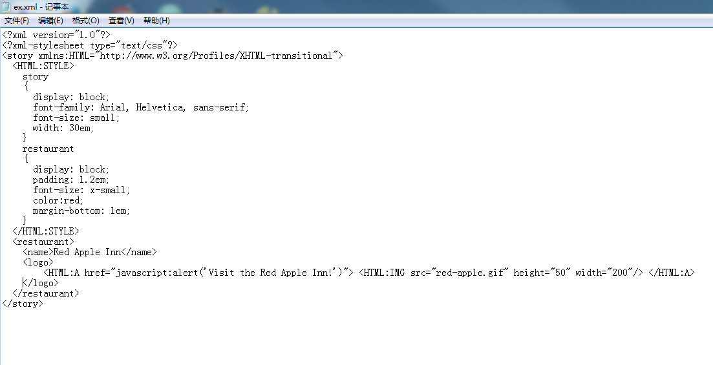
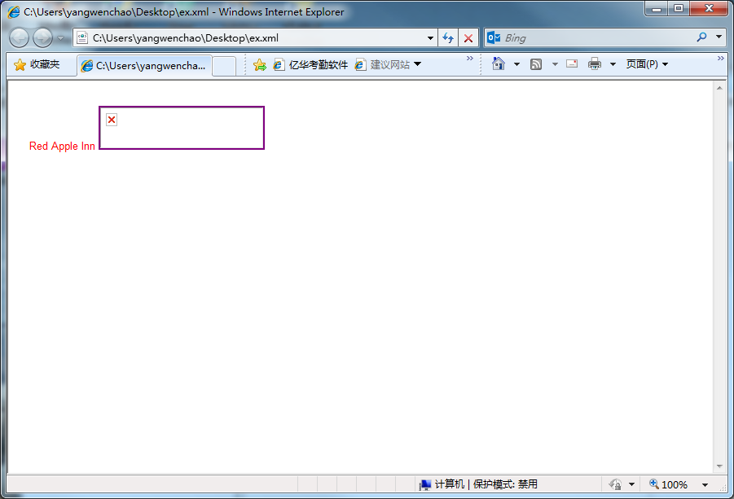
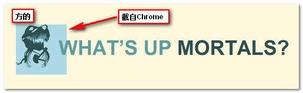

###  @namespace {#namespace}

根据维基百科的定义，[命名空间(namespace)](http://zh.wikipedia.org/wiki/XML%E5%91%BD%E5%90%8D%E7%A9%BA%E9%97%B4)可以让XML文档可能包括来自多个XML词汇表的元素或属性彼此间没有冲突。

**在XML中应用：**

**XHTML文档的命名空间：**

&lt;html xmlns=&quot;http://www.w3.org/1999/xhtml&quot;&gt;

上面代码中的URL地址就是个简单的命名空间名称，其并不指向之一实际的在线地址。浏览器不是使用或处理这个URL。当某个人阅读这里的文档代码的时候可以轻松理解命名空间所指。

为何CSS命名空间要引入：

命名空间模块很小，很简单，大概很少需要，但是正因为其小巧，所以添加到CSS中并没有什么负担。事实上，很多浏览器很早的时候就支持了。

它定义的唯一的事情就是在CSS中如何声明一个XML命名空间的前缀。当你使用的选择器仅匹配特定命名空间下的元素，则这东西就很管用。

例如：SVG使用了和HTML一样的元素和CSS属性。如果你为SVG文档和HTML文档同时应用了一个样式文件的话，最好对SVG和HTML做样式分离以避免出现样式覆盖的情况。

**使用**

1.  声明你的XHTML文档类型：

&lt;!DOCTYPE html PUBLIC &quot;-//W3C//DTD XHTML 1.0 Strict//EN&quot;

&quot;http://www.w3.org/TR/xhtml1/DTD/xhtml1-strict.dtd&quot;&gt;

&lt;html xmlns=&quot;http://www.w3.org/1999/xhtml&quot; xml:lang=&quot;en&quot; lang=&quot;en&quot;&gt;

1.  在你的样式文件中，为CSS规则定义默认命名空间：

@namespace &quot;http://www.w3.org/1999/xhtml&quot;;

@namespace svg &quot;http://www.w3.org/2000/svg&quot;;

1.  有了上面的声明。你就可以只为SVG原因应用CSS规则：

/* 匹配所有的XHTML &lt;a&gt; 元素, 因为 XHTML 是默认无前缀命名空间 */

a {}

/* 匹配所有的 SVG &lt;a&gt; 元素 */

svg|a {}

/* 匹配 XHTML 和 SVG &lt;a&gt; 元素 */

*|a {}

而其他规则默认会应用到HTML上。[demo页面](http://nimbupani.com/demo/namespaces/index.html)

上图中左边的SVG图片就是使用了SVG命名空间定义样式